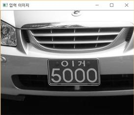
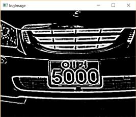
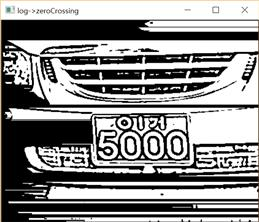
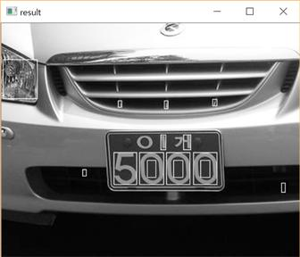
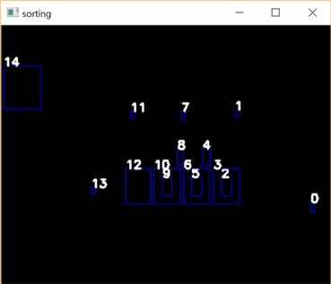
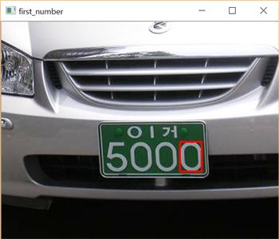
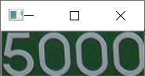
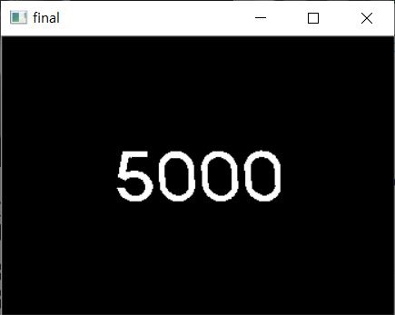
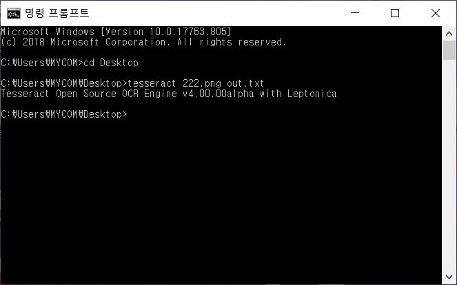
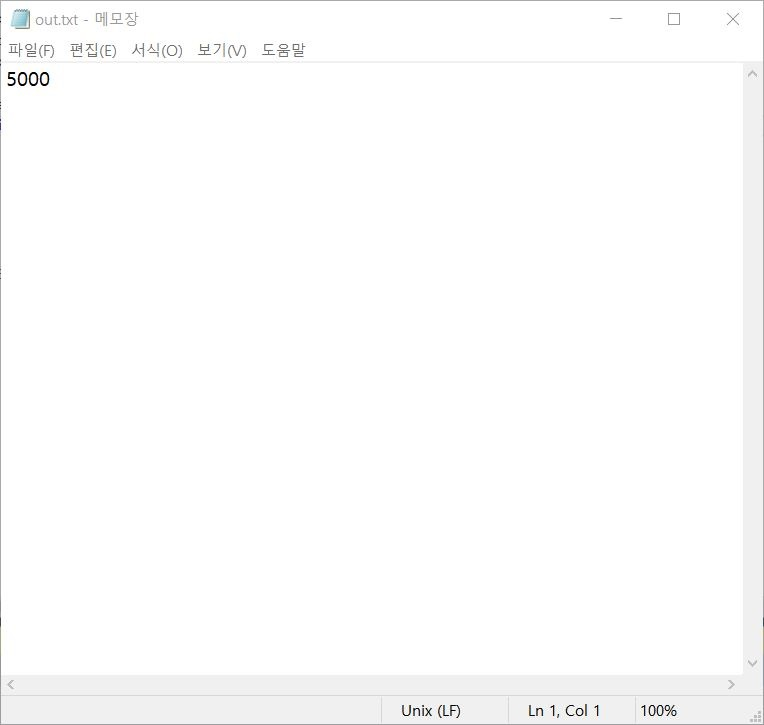

## Car Plate Detection

정차된 차량 사진에서 차량 번호판을 인식하고 그 숫자를 읽어내는 알고리즘을 구현했습니다. 



img Laplace of Gaussian변환



영교차(zeroCrossing) : 영상의 엣지를 강하게 나타내기 위해 사용



ConnectedComponetsWithStats 함수를 통한 블로핑



오른쪽부터 라벨링



연속되는 4자리 수를 찾기



ROI 영역 출력



주변 값 0으로 패딩



Tesseract-OCR을 통한 텍스트 분석



결과값 출력




[참조논문](https://home.kiu.ac.kr/~ho/face/2011-04-18-plate.pdf)

## 코드 리뷰
```
vector<vector<Point> > contours;  //  Vectors for 'findContours' function.
vector<Vec4i> hierarchy;

Mat input_image = imread("number.jpg");
Mat input_gray_image;
cvtColor(input_image, input_gray_image, CV_BGR2GRAY);
double ratio, delta_x, delta_y, gradient;  //  Variables for 'Snake' algorithm.
int select, plate_width, count, friend_count = 0, refinery_count = 0;

imshow("입력 이미지", input_gray_image);
```
변수명 설정 및 이미지 grayscale로 변환

```
const int ksize = 11;
float logArr[ksize * ksize];
int s, t, k = 0;
float g;
float sigma = 0.3f * (ksize / 2 - 1.0f) + 0.8f;
for (s = -ksize / 2; s <= ksize / 2; s++)
    for (t = -ksize / 2; t <= ksize / 2; t++)
    {
        g = exp(-((float)s*s + (float)t*t) / (2 * sigma*sigma));
        g *= (1 - ((float)s*s + (float)t*t) / (2 * sigma*sigma));
        g /= (3.141592f*sigma*sigma*sigma*sigma);
        logArr[k++] = -g;
    }
Mat logKernel(ksize, ksize, CV_32F, logArr);
Mat logImage;
filter2D(input_gray_image, logImage, CV_32F, logKernel);
imshow("logImage", logImage);
```