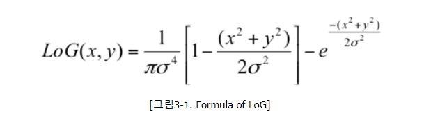
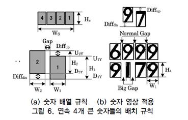

## Car Plate Detection

정차된 차량 사진에서 차량 번호판을 인식하고 그 숫자를 읽어내는 알고리즘을 구현했습니다. 


img Laplace of Gaussian변환


영교차(zeroCrossing) : 영상의 엣지를 강하게 나타내기 위해 사용


ConnectedComponetsWithStats 함수를 통한 블로핑


오른쪽부터 라벨링


연속되는 4자리 수를 찾기


ROI 영역 출력


주변 값 0으로 패딩


Tesseract-OCR을 통한 텍스트 분석


결과값 출력


[참조논문](https://home.kiu.ac.kr/~ho/face/2011-04-18-plate.pdf)

## 코드 리뷰
```
vector<vector<Point> > contours;  //  Vectors for 'findContours' function.
vector<Vec4i> hierarchy;

Mat input_image = imread("number.jpg");
Mat input_gray_image;
cvtColor(input_image, input_gray_image, CV_BGR2GRAY);
double ratio, delta_x, delta_y, gradient;  //  Variables for 'Snake' algorithm.
int select, plate_width, count, friend_count = 0, refinery_count = 0;

imshow("입력 이미지", input_gray_image);
```
변수명 설정 및 이미지 grayscale로 변환

```
const int ksize = 11;
float logArr[ksize * ksize];
int s, t, k = 0;
float g;
float sigma = 0.3f * (ksize / 2 - 1.0f) + 0.8f;
for (s = -ksize / 2; s <= ksize / 2; s++)
    for (t = -ksize / 2; t <= ksize / 2; t++)
    {
        g = exp(-((float)s*s + (float)t*t) / (2 * sigma*sigma));
        g *= (1 - ((float)s*s + (float)t*t) / (2 * sigma*sigma));
        g /= (3.141592f*sigma*sigma*sigma*sigma);
        logArr[k++] = -g;
    }
Mat logKernel(ksize, ksize, CV_32F, logArr);
Mat logImage;
filter2D(input_gray_image, logImage, CV_32F, logKernel);
imshow("logImage", logImage);
```
Log(Laplacian of Gaussian) 필터 적용


2차 미분의 장점은 엣지의 중심에 위치한 임의의 엣지를 찾을 수 있어 엣지를 찾는데 더욱 특화되어 있다. 2차 미분 결과 영상의 엣지 부분에서 부호가 바뀌게 되는데 이를 영교차라고 한다. 

라플라시안 연산의 경우 잡음에 민감하기 때문에 Gaussian Smoothing을 수행하여 잡음을 제거하고 라플라시안 연산을 이용한다. 이를 Log(Laplacian of Gaussian)이라고 한다. 

```
Mat zeroCross = Mat::zeros(input_gray_image.size(), CV_8U);
ZeroCrossing(logImage, zeroCross, 100);
imshow("log->zeroCrossing", zeroCross);
```
zeroCrossing을 통해 엣지 부분을 정확히 찾아낸다. 

```
Mat img_labels, stats, centroids;
Mat drawing;
input_gray_image.copyTo(drawing);

int numOfLabels = connectedComponentsWithStats(zeroCross, img_labels, stats, centroids, 8, CV_32S);

vector<int> boundRect;
vector<int> index;

int numOfratio = 0;
for (int j = 0; j < numOfLabels; j++){

    int area = stats.at<int>(j, CC_STAT_AREA);
    int left = stats.at<int>(j, CC_STAT_LEFT);
    int top = stats.at<int>(j, CC_STAT_TOP);
    int width = stats.at<int>(j, CC_STAT_WIDTH);
    int height = stats.at<int>(j, CC_STAT_HEIGHT);

    ratio = width / height;
    if (ratio <= 0.9)
    {
        rectangle(drawing, Point(left, top), Point(left + width, top + height), Scalar(255, 0, 0), 1);
        numOfratio++;
        boundRect.push_back(left);  //left 정보
        index.push_back(j); //label 정보
    }
}
imshow("result", drawing);
```
ConnectedComponentWithStats 함수를 이용해 blob들을 찾아내고 가로 세로의 비율이 0.9 이하인 것(숫자 특성에 가까움)을 추려낸다.

```
vector<int> order(index.size());

//Sort
int far_right = -1;
int k1 = 0;
int temp;
for (int i = 0; i < numOfratio; i++)
{
    for (int j = 0; j < numOfratio; j++)
    {
        if (far_right < boundRect[j])
        {
            far_right = boundRect[j];
            order[k1] = index[j];  //오른쪽에 있는 순서대로 label정보 넣기
            temp = j;
        }

    }
    boundRect[temp] = -1;
    k1++;
    far_right = -1;
}
Mat sorting = Mat::zeros(drawing.size(), CV_8UC3);
	
int num_plate = 0;
for (int j = 0; j < numOfratio; j++)
{
    int area = stats.at<int>(order[j], CC_STAT_AREA);
    int left = stats.at<int>(order[j], CC_STAT_LEFT);
    int top = stats.at<int>(order[j], CC_STAT_TOP);
    int width = stats.at<int>(order[j], CC_STAT_WIDTH);
    int height = stats.at<int>(order[j], CC_STAT_HEIGHT);

    rectangle(sorting, Point(left, top), Point(left + width, top + height), Scalar(255, 0, 0), 1);
    putText(sorting, to_string(j), Point(left, top), FONT_HERSHEY_SIMPLEX, 0.5, Scalar(255, 255, 255), 2);
}

imshow("sorting", sorting);
```
이 후 오른쪽 부터 순서대로 label을 붙인다. 

```
int h1 = 0;
vector<int> cand;
for (int i = 0; i < numOfratio; i++)
{
    for (int j = i + 1; j < numOfratio; j++)
    {
        if (abs(stats.at<int>(order[i],CC_STAT_TOP) - stats.at<int>(order[j], CC_STAT_TOP)) < 0.2 * stats.at<int>(order[i], CC_STAT_WIDTH))
        {
            num_plate++;
            cand.push_back(j);
        }

    }
    if (num_plate == 3)
    {
        h1 = i;
        break;
    }
    cand.clear();
    num_plate = 0;

}
```
차량 번호판의 경우 숫자 네개가 연속하고 각각의 숫자간에 관계를 가진다. 



사각형 사이의 normal gap < 0.2 X 사각형 width 인 번호영역을 우측에서 좌측으로 탐색하며 찾게된다. 

```
Mat temp_image;
input_image.copyTo(temp_image);
//Mat result = Mat::zeros(drawing.size(), CV_8UC3);
rectangle(temp_image, Point(stats.at<int>(order[h1], CC_STAT_LEFT), stats.at<int>(order[h1], CC_STAT_TOP))
    , Point(stats.at<int>(order[h1], CC_STAT_LEFT) + stats.at<int>(order[h1], CC_STAT_WIDTH),
    stats.at<int>(order[h1], CC_STAT_TOP) + stats.at<int>(order[h1], CC_STAT_HEIGHT)), Scalar(0, 0, 255), 2);
//imshow("first_number", temp_image);
```
연속하는 네개의 숫자를 찾았다. 

```
int far_left = cand[cand.size() - 1];

int width = stats.at<int>(order[h1], CC_STAT_LEFT) + stats.at<int>(order[h1], CC_STAT_WIDTH) - stats.at<int>(order[far_left], CC_STAT_LEFT);
int end_y= stats.at<int>(order[h1], CC_STAT_TOP) + stats.at<int>(order[h1], CC_STAT_HEIGHT);
int end_x = stats.at<int>(order[h1], CC_STAT_LEFT) + stats.at<int>(order[h1], CC_STAT_WIDTH);
cout << "width" << width << endl;
cout << "end_x" << end_x - 1.5*width << "end_y" << end_y - stats.at<int>(order[h1], CC_STAT_HEIGHT)*1.8 << endl;
Mat roi_image = input_image(Rect(end_x - width, end_y - stats.at<int>(order[h1], CC_STAT_HEIGHT), width, stats.at<int>(order[h1], CC_STAT_HEIGHT)));

imshow("plate", roi_image);
Mat result_image, final_image;
cvtColor(roi_image, result_image, CV_BGR2GRAY);
imshow("tmp", result_image);
threshold(result_image, final_image, 100, 255, THRESH_BINARY);
copyMakeBorder(final_image, final_image, 100, 100, 100, 100, BORDER_CONSTANT, Scalar(0, 0, 0));
imshow("final", final_image);
waitKey();
return 0;
```
이 후 관심영역(ROI)를 분리해내고 이를 이진화하여 패딩을 한다. 이는 Tesseract-OCR의 원활한 인식을 위해 수행하였다. 